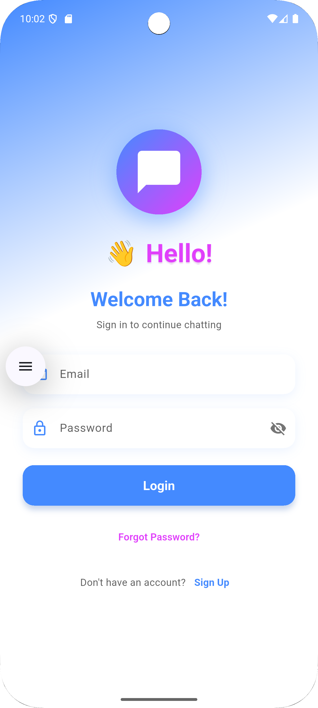
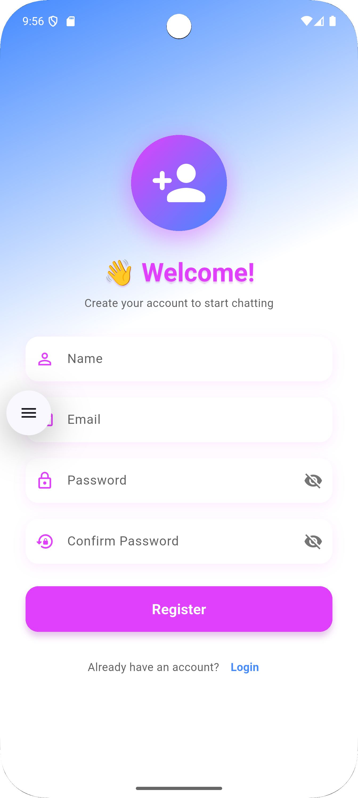
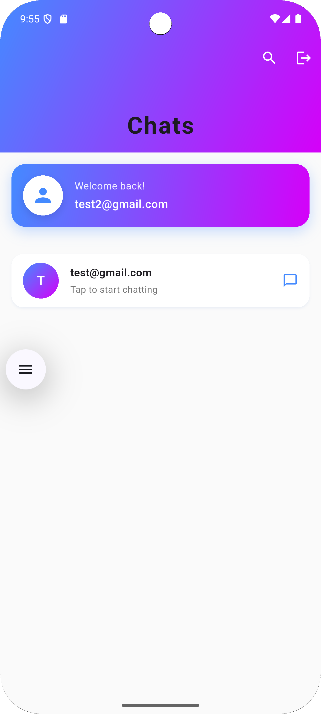
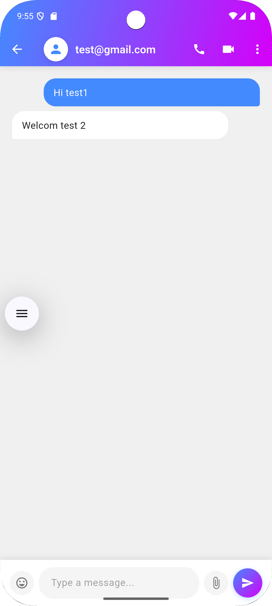

# Flutter-Chat-App
A **real-time chat messenger app** built with Flutter, Firebase, and modern design principles. This app supports cross-platform messaging with a sleek and intuitive user interface.

## 🚀 Features

- **Real-time Messaging**: Send and receive messages instantly.
- **Cross-Platform**: Works seamlessly on Android and iOS.
- **Firebase Integration**: Authentication, Firestore database, and cloud storage.
- **Push Notifications**: Get notified of new messages.
- **Custom Themes**: Light and dark mode support.
- **Media Sharing**: Share images, videos, and files.
- **Group Chats**: Create and manage group conversations.

---

## 📸 Screenshots

| Login Screen | Register Screen | Home Screen | Chat Screen |
|--------------|-----------------|-------------|-------------|
|  |  |  |  |

---

## 🛠️ Tech Stack

- **Frontend**: Flutter (Dart)
- **Backend**: Firebase (Firestore, Authentication, Cloud Functions)
- **State Management**: Provider
- **Build Tools**: Gradle, CMake
- **CI/CD**: GitHub Actions

---

## 🧑‍💻 Getting Started

### Prerequisites

- Flutter SDK installed ([Installation Guide](https://flutter.dev/docs/get-started/install))
- Firebase project setup ([Firebase Console](https://console.firebase.google.com))
- Android Studio or Visual Studio Code
